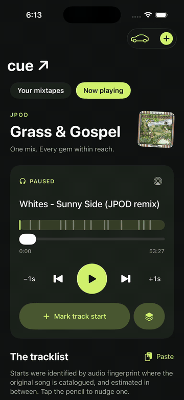

# Cue engine

Find where every song starts inside a DJ mix or mixtape, so a player can skip song by song. Output is a normal `.m4a` with MP4 chapters that any chapter-aware player understands; the [Cue iPhone app](#the-app) reads them for lock-screen titles and car controls.



## What it does

```
cue_engine/ingest.py "My Mix.mp3" --out out/
```

1. Reads a tracklist if one is available: a `My Mix.txt` beside the file, `--tracklist`, or the page description when you pass a URL. Timestamps are used as-is.
2. Otherwise identifies songs with a fingerprint provider (pluggable; see below), aligns free 30-second preview clips of the tracklist's titles into the mix, and runs a transition detector trained on real DJ mixes.
3. `resolve.py` combines the anchors: fingerprints say *which* song is playing and roughly when it was first heard, the detector places the exact cut just before that, page titles name the songs (remixes keep the DJ's naming), and the detector splits any stretch nothing identified.
4. Writes `out/My Mix.m4a` with chapters, title/artist/date/genre tags, and `My Mix.tracklist.txt`.

CPU only. About a minute per hour of audio on a laptop.

## Accuracy

Blind scores against DJ-published timestamps on eight public mixes (190 boundaries), boundaries only:

| Method | within 10 s | within 20 s | within 30 s |
| --- | --- | --- | --- |
| Fingerprint offsets alone | 62 | 84 | 131 |
| Fingerprints + transition detector (this engine) | 99 | 123 | 144 |
| Preview alignment + page titles, no fingerprint service (dancehall mix only) | 13/24 | 20/24 | 21/24 |

Per genre: cut-style mixes (dancehall, hardstyle, jungle) sit at the level of human annotators, whose published disagreement is about 9 seconds. Long beat-matched house blends are around 25 seconds median; the DJ's own timestamp marks the mix-in point, which is ambiguous even for people.

Things that did not help, measured: multimodal LLMs listening to the audio (no better than a novelty curve, invented titles), beat-grid snapping (no change against DJ-typed timestamps), retraining the detector on 3× more minute-resolution labels (no clear gain; label precision is the limit).

## Fingerprint providers

`--provider` selects how songs are identified:

- `audd`: [AudD](https://audd.io) enterprise endpoint, one upload per mix, timestamps returned. Token in `~/.audd_key` or `AUDD_API_TOKEN`. Licensed for apps.
- `align`: no fingerprint service. Needs a tracklist; previews from the iTunes Search API or Deezer are aligned into the mix with tempo-tolerant chroma DTW.
- `shazam`: grid probing through the unofficial `shazamio` client. **Personal use only**; it is not licensed for distribution, it throttles after roughly 100 requests, and it needs Python 3.12. Kept as a reference implementation of the probing/merging logic.
- `auto` (default): AudD if a token exists, otherwise Shazam, plus alignment when a tracklist exists.

Adding a provider means producing the probe rows `resolve.py` consumes: `{t, title, artist, key, offset}` per probe.

## Transition detector

`models/detector-v1.pt` is a dilated 1-D CNN over per-second features (log-mel, chroma, spectral contrast, onset, tempo) trained on 53 mixes from the [DJ Mix Dataset](https://github.com/mir-aidj/djmix-dataset); `detector-v2.pt` on 172. `eval/djmix_fetch.py`, `eval/djmix_prep.py`, `eval/train_detector.py` reproduce it. Minute-resolution labels are snapped to the strongest local change before training.

`detect_nn.py <audio>` prints transition probabilities on their own.

## Setup

```sh
uv venv .venv && uv pip install --python .venv/bin/python -r requirements.txt
brew install ffmpeg yt-dlp          # or your package manager
.venv/bin/python cue_engine/ingest.py mix.mp3 --provider align --out out/
```

`batch_ingest.py <dir>` processes a folder in parallel. `eval/` holds the scorers used for the table above.

## The app

Cue for iPhone (SwiftUI) plays the output: import from Files, AirDrop, or the Music library, drop files into the Cue folder, lock-screen titles, and car controls where one Next skips a song and two skip a mixtape. Everything stays on the phone. The app is in a separate repository.

## Contributing

Most valuable: second-accurate boundary annotations for mixes (the detector is limited by label precision), fingerprint providers, and tracklist scrapers for more sites. Please don't contribute anything that redistributes mixes.

MIT licence.
